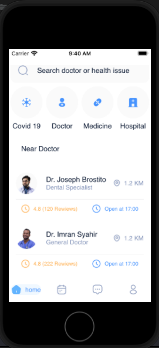

## Верстка мобильного приложения для клиники

### Немножко предыстории...

К сожалению, я не являюсь счастливым обладателем мак бука, но сделать эту лабораторную работу мне очень хотелось. 
Думаю, излишними будут упоминания о том, как проблемно запустить MacOS на Windows. Мной было опробовано несколько виртуальных машин, несколько версий операционной системы, несколько версий Xcode...
Однако, самой хорошо работающей на моем ноутбуке оказалась MacOS 12 Monterey, а проект был собран в Xcode 13.4.1.

Но поскольку система на виртуальной машине работала очень уж медленно и неохотно, большая часть кода была написана вслепую, а позже отлажена и собрана в Xcode.
В связи с этим, пришлось потратить очень много времени и на установку, и на написание, и на отладку кода. Поэтому я не успел реализовать все, что хотел (не бейте).

## Результат
Была выполнена верстка страницы приложения для клиники. 
На данной странице присутствуют приветствие, информация о докторах и врачебных приемах, навигационная панель, доступные категории и другие элементы дизайна

